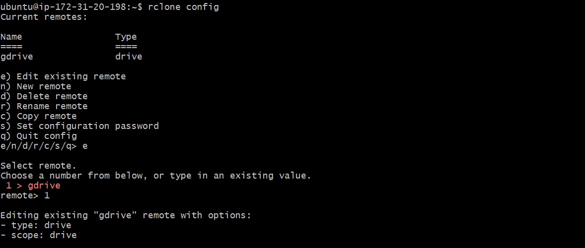
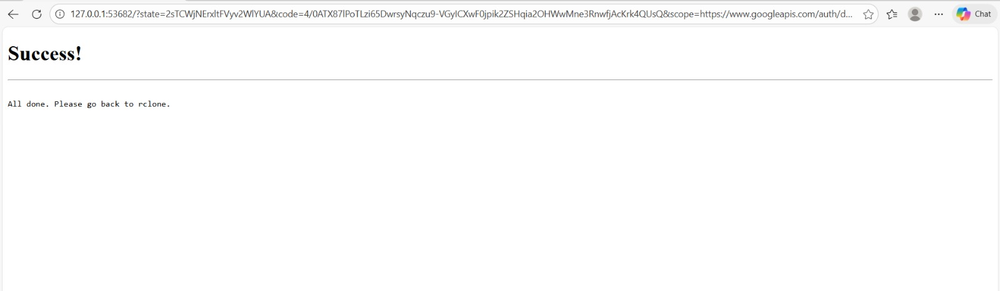
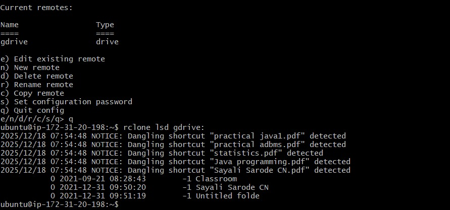
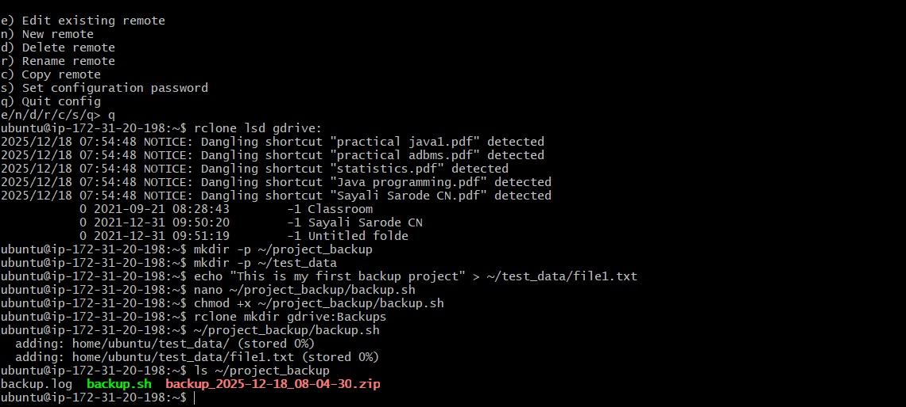
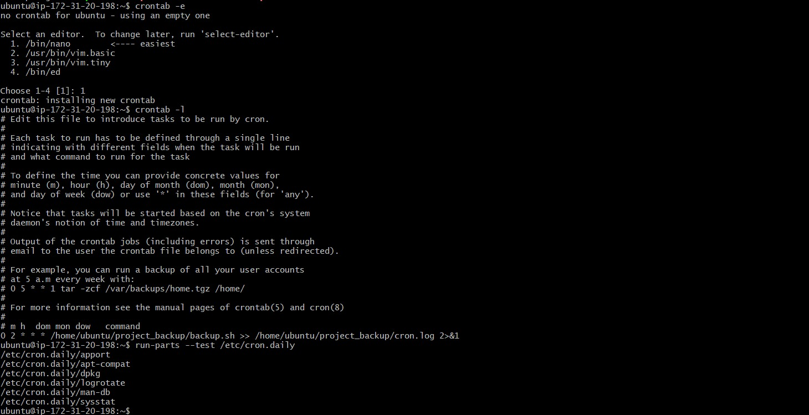
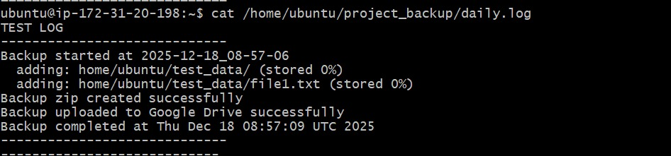
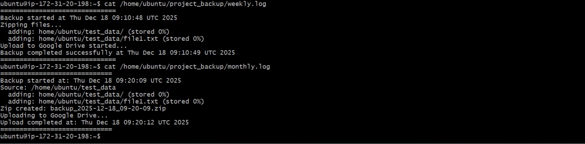

# Automated Backup and Rotation Script with Google Drive Integration

## Introduction

This project demonstrates how to automate backups from an AWS EC2 instance to Google Drive using **Rclone** and **Shell Scripting**.  
The solution performs **daily, weekly, and monthly backups**, maintains logs for each backup type, and uses **cron jobs** for automation.

This project showcases real-world DevOps practices including Linux automation, cloud storage integration, logging, and scheduling.

---

## Services & Tools Used

1. AWS EC2 (Ubuntu 22.04)
2. Google Drive
3. Rclone
4. Linux Shell Scripting (Bash)
5. Cron Jobs

---

## Step 1: Launch EC2 Instance

* Go to AWS Console → EC2
* Click **Launch Instance**
* Choose **Ubuntu 22.04 AMI**
* Instance Type: `t2.micro`
* Configure Security Group:
  * Allow SSH (22)
* Launch the instance and connect via SSH


---

## Step 2: Update System & Install Rclone

```
bash
sudo apt update -y
sudo apt install rclone -y

```

## Step 3: Configure Google Drive using Rclone

```
rclone config
```



### Configuration steps:

* New remote → name: gdrive

* Storage type: Google Drive

* Scope: Full access

* Authentication using browser




## Verify connection:
```
rclone lsd gdrive:
```


## Step 4: Create Backup Directory Structure

```
mkdir -p /home/ubuntu/project_backup/{daily,weekly,monthly}
mkdir -p /home/ubuntu/test_data
```

### Create sample files:

```
echo "Test Backup File" > /home/ubuntu/test_data/file1.txt
```
## Step 5: Create Backup Script

Create backup.sh

```
#!/bin/bash

SOURCE_DIR="/home/ubuntu/test_data"
BACKUP_DIR="/home/ubuntu/project_backup"
DATE=$(date +"%Y-%m-%d")

# Daily Backup
tar -czf $BACKUP_DIR/daily/daily_$DATE.tar.gz $SOURCE_DIR
rclone copy $BACKUP_DIR/daily gdrive:Daily_Backup --log-file=$BACKUP_DIR/daily.log

# Weekly Backup
tar -czf $BACKUP_DIR/weekly/weekly_$DATE.tar.gz $SOURCE_DIR
rclone copy $BACKUP_DIR/weekly gdrive:Weekly_Backup --log-file=$BACKUP_DIR/weekly.log

# Monthly Backup
tar -czf $BACKUP_DIR/monthly/monthly_$DATE.tar.gz $SOURCE_DIR
rclone copy $BACKUP_DIR/monthly gdrive:Monthly_Backup --log-file=$BACKUP_DIR/monthly.log
```

### Make executable:
```
chmod +x /home/ubuntu/project_backup/backup.sh
```



## Step 6: Test Backup Script Manually
```
/home/ubuntu/project_backup/backup.sh
```

### Check logs:

```
cat /home/ubuntu/project_backup/daily.log
cat /home/ubuntu/project_backup/weekly.log
cat /home/ubuntu/project_backup/monthly.log
```

## Step 7: Setup Cron Jobs for Automation
```
crontab -e
```


### Add entries:
```
0 1 * * * /home/ubuntu/project_backup/backup.sh
0 2 * * 0 /home/ubuntu/project_backup/backup.sh
0 3 1 * * /home/ubuntu/project_backup/backup.sh
```

### Step 8: Verify Google Drive Backups

* Login to Google Drive

* Verify folders:

      * Daily_Backup

      * Weekly_Backup

      * Monthly_Backup





## Step 9: Logging & Monitoring

Each backup generates logs:

* daily.log

* weekly.log

* monthly.log

These logs help in monitoring backup success or failures.





## Conclusion: 

This project successfully implements an automated Google Drive backup solution using Rclone on AWS EC2.
It demonstrates Linux automation, cloud storage integration, scheduling with cron, and real-world DevOps operational practices.
